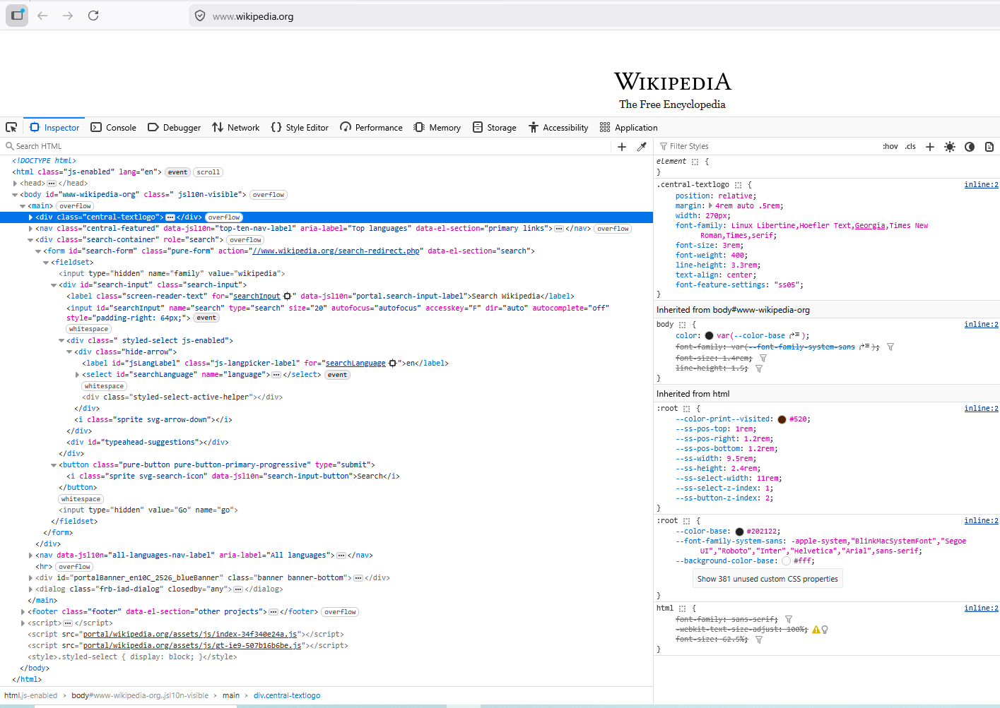

# website 1 https://example.com
## Answers as per quiz.
### 1. HTML tags used in the website
- `<html></html>`
- `<titl>`
- `<link>`
- `<meta>`
- `<style></style>`
- `<body></body>`
- `<div></div>`
- `<h1></h1>`
- `<p></p>`
- `<a>`
### 2. Page title
- `<title>Example Domain</title>`
### 3. Number of headings in the website
- We have one heading which is `<h1>Example Domain</h1>
# Website 2: https://developer.mozilla.org`
## Answers as per quiz.
### 1. The tag wrapping the navigation menu
- the navigatin menu is wrapped in `<nav></nav>` tag.
### 2. The search bar structuR
The search feature is contained inside a `<div>` element which is within the `navigation__search` class.
Inside we have custom `<mdn-search-button>` component that contains a `<button>` element. The search icon is created using SVG elements(`<svg>`,`<path> & <`<circle>` and displayed inside the button
### structure
```
html
<div class="navigation__search">
  <mdn-search-button>
    <button >
      <svg>
        <path></path>
        <circle></circle>
      </svg>
    </button>
  </mdn-search-button>
</div>
```
### 3. What happens to the styles when you hover over links.
- The cursor changes( from arrow) to a pointer(hand icon).
- The link is highlighted with darker backgroung color.
- The link becomes more visually prominent, indicating it is clickable.
# Website 3: [Any website of your choice](https://www.wikipedia.org)
Website: https://www.wikipedia.org
## Answers as per quiz.
### 1. Five different HTML elements identified.
- `<html>`
- `<head>`
- `<body>`
- `<main>`
- `<div>`
- `<nav>`
- `<form>`
### 2. List of inputs in the foam element.

**The search foam is:**
```
html
<form id="search-form" class="pure-form">
```
**Inputs found inside form:**
- `<input type="hidden" name="family" value="wikipedia">`
- `<input id="searchInput" name="search" type="search">`
- `<select id="searchLanguage" name="language">`
- `<button type="submit">`
- `<input type="hidden" value="Go" name="go">`
**the form allows user to**
  - Enter a serch tearm.
  - Select language.
  - submit the search.
### 3. screenshot of the Elements panel.

